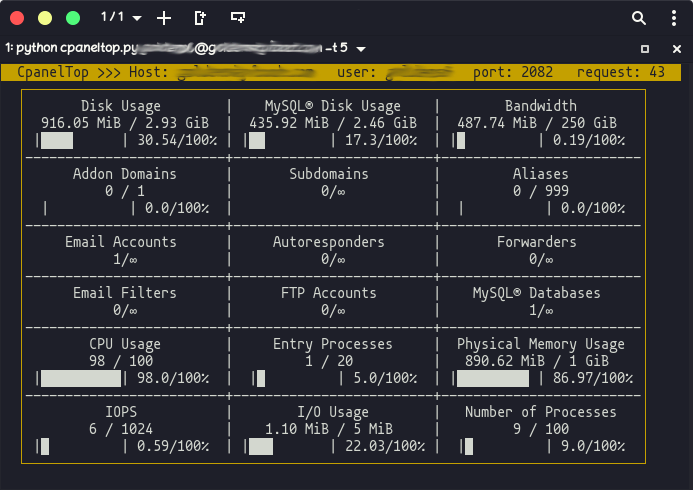

           

## Description
### CpanelTop is a Python command line script to monitor the usage of cpanel resources. cpaneltop can login to your host panel and fetch the statistics table and display resource usage in your terminal

